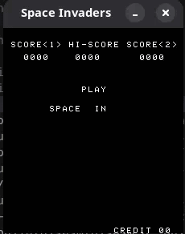

# Simple Intel 8080 Emulator
This is a simple intel 8080 emulator that can also run space invaders. This project makes use of SDL2 for the game window and Dear Imgui for a basic debugger window. I am aware that there are basically a million other 8080 emulators out there, this is just a project for me to dip my toes into emulation to prepare for a more interesting project :p.

 

## Build & Usage

```bash
make
cd build/bin
./main [INVADERS ROM DIRECTORY]

# debug mode
make debug
cd build/bin
./dbgmain [INVADERS ROM DIRECTORY]
```

To run the emulator, you have to direct the program to a directory with the rom files:
`
invaders.h, invaders.e, invaders.f and invaders.g
` 

## Space Invader Controls

| Command    | Key |
| -------- | ------- |
| Insert Coin  | C    |
| P1 Start | Return     |
| P1 Left & Right    | Left Arrow & Right Arrow    |
| P1 Shoot    | Space    |
| P2 Start | Backspace     |
| P2 Left & Right    | A & D    |
| P2 Shoot    | S    |


## Resources

### Intel 8080 CPU

[8080 Assembly Language Reference Card](https://vtda.org/docs//computing/Intel/98-005B_Intel8080AssemblyLanguageReferenceCard_March76.pdf)

[8080 Microcomputer Systems User's Manual](https://bitsavers.trailing-edge.com/components/intel/MCS80/98-153B_Intel_8080_Microcomputer_Systems_Users_Manual_197509.pdf)

[Intel 8080 Assembly Language Programming Manual](https://altairclone.com/downloads/manuals/8080%20Programmers%20Manual.pdf)

### Space Invaders

[Computer Archeology Space Invaders Hardware Documentation](https://www.computerarcheology.com/Arcade/SpaceInvaders/Hardware.html)

[Computer Archeology Space Invaders Documented Code](https://www.computerarcheology.com/Arcade/SpaceInvaders/Code.html) - honestly the best space invaders resource you could ask for.

[MAME Hardware Documentation](https://github.com/mamedev/mame/tree/2e3073c71380148d5bfce176d28874118922e25a)

### CP/M CPU Tests

[8080 CPU Tests](https://altairclone.com/downloads/cpu_tests/)

great resources for emulating some simple cp/m behaviour to run the tests.

[BDOS System Calls](https://www.seasip.info/Cpm/bdos.html)

[CP/M Zero Page](https://en.wikipedia.org/wiki/Zero_page_(CP/M))
